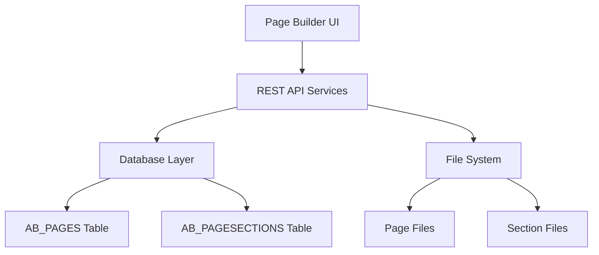

# Page Builder - Complete Documentation

## Table of Contents
1. [Overview](#overview)
2. [Architecture](#architecture)
3. [What is a Page](#what-is-a-page)
4. [What are Sections](#what-are-sections)
5. [Getting Started](#getting-started)
6. [API Endpoints](#api-endpoints)
7. [File Structure](#file-structure)
8. [Development Guide](#development-guide)
9. [Integration](#integration)
10. [Examples](#examples)

## Overview

**Page Builder** is a comprehensive development platform for technical users to create dynamic, data-driven web pages through code. It requires knowledge of JavaScript, SQL, and HTML templating to build interactive dashboards and reports.

### What Developers Can Do
- **Write JavaScript**: Create data scripts that fetch information from databases using SQL queries
- **Build Templates**: Design page layouts using HTML with Nunjucks templating for dynamic content
- **Create Filters**: Add interactive controls that users can use to filter data
- **Reuse Components**: Build sections once and use them across multiple pages
- **Embed Sections**: Use sections within pages, sections within sections, and dynamic loading
- **Use Attribute Handlers**: Create navigation, interactivity, and component communication without JavaScript
- **Access Code Snippets**: Use built-in templates for common patterns and components
- **Preview Changes**: See your pages in real-time as you develop them
- **Integrate Anywhere**: Embed your pages into dashboards or other applications
- **Import/Export**: Share page configurations between environments

### Technology Stack
- **Backend**: Node.js, Express, Oracle Database
- **Frontend**: Vue.js 2.x, Bootstrap 4, Bootstrap Vue (for Page Builder UI)
- **Server-side Templating**: Nunjucks (primary template engine for pages)
- **Client-side Framework**: Vue.js (can be embedded in Nunjucks templates)
- **Charts**: Chart.js with custom extensions
- **Editor**: Monaco Editor for code editing

## Architecture

### System Components



### Service Initialization

The Page Builder is initialized in the main server (`funds_sc/index.js`):

```javascript
const initPageBuilder = require("./pagebuilder");
initPageBuilder({ 
    "app": servicemgr.app, 
    "pages_dir": path.join(__dirname, "pages"), 
    "pool": DB,
    "app_path": config.APPS_DIR_PATH 
});
```

### API Structure

The Page Builder exposes RESTful endpoints under `/pagebuilder/`:
- **Pages**: `/pagebuilder/page/*` - CRUD operations for pages
- **Sections**: `/pagebuilder/pagesection/*` - CRUD operations for page sections

## What is a Page

A **Page** is the fundamental building block of the Page Builder system. It represents a complete web page that can display data, charts, tables, and interactive components.

### Important: Templating Approach

**Primary Template Engine: Nunjucks (Server-side)**
- All page templates should primarily use **Nunjucks syntax** for server-side rendering
- Data from SQL scripts is bound to templates using Nunjucks variables: `{{variable_name}}`
- Use Nunjucks conditionals and loops: ``, ``

**Secondary: Vue.js Components (Client-side)**
- Vue.js can be embedded within Nunjucks templates for interactive behavior
- Bootstrap Vue components (like `<b-table>`) work within Nunjucks templates
- Vue.js is used by the Page Builder interface itself, but page templates should use Nunjucks as the primary engine

### Page Components

Every page consists of three core files:

#### 1. Page Script (`pagescript.js`)
**Purpose**: Write JavaScript to fetch and prepare data for your page

**Available Variables**:
- `filters` - Array of filter objects passed through process API
- `userobj` - Current user information and permissions  
- `session` - Any data passed from client-side using `setSessionProcess`
- `context` - Object to store data for the template
- `page3.db` - Database connection for queries (lowercase)

**Filter Structure**:
Each filter object contains:
```javascript
{
    type: "STRING" | "DATE" | "NUMBER" | "SELECT",
    field: "COLUMN_NAME", 
    value: "actual_value",
    asgn: "eq" | "like" | "noteq",
    label: "Display Name" // for UI
}
```

**What you write**:
```javascript
// Process filters from page
const APPLIED_FILTERS = {};
filters.forEach(filter => {
    APPLIED_FILTERS[filter.field] = filter.value;
});

// Use session data (e.g., for pagination)
const currentPage = session?.pagination?.currentPage || 1;
const limit = session?.pagination?.limit || 10;

// Fetch data from database
const SQL_DATA = await page3.DB.execSQL(`
    SELECT portfolio_code, portfolio_name, aum, returns
    FROM portfolio_summary 
    WHERE report_date = :report_date
`, { report_date: APPLIED_FILTERS.REPORT_DATE });

// Pass data to template
context.portfolios = SQL_DATA.rows;
context.total_count = SQL_DATA.rows.length;
context.filters = filters;
context.session = session;
context.user_info = userobj;
```


#### 2. Page Template (`pagetemplate.njk`)
**Purpose**: Defines the HTML structure and layout
**Features**:
- Nunjucks templating syntax
- Bootstrap components
- Vue.js integration for interactivity
- Data binding from page script

**Structure**:
```html
<div class="container-fluid">
    <!-- Header Section -->
    <div class="row">
        <div class="col-12">
            <h1>{{page_title}}</h1>
        </div>
    </div>
    
    <!-- Data Display -->
    <div class="row">
        <div class="col-md-6">
            <div class="card">
                <div class="card-body">
                    <h5 class="card-title">Summary</h5>
                    <p>Total Records: {{total_records}}</p>
                </div>
            </div>
        </div>
    </div>
    
    <!-- Section Placeholder -->
    <div 
        data-pb-section="SECTION_NAME" 
        data-pb-section-trigger-on-load
    ></div>
</div>
```

#### 3. Page Filter (`pagefilter.njk`)
**Purpose**: Create interactive filters that pass data to your page script

**Use the `<page-filters>` component**:
```html
<page-filters 
    :filters='[{
        type: "DATE", 
        field: "ACC_FROM_DATE",
        asgn: "like",
        label: "From Date"
    },{
        type: "DATE", 
        field: "ACC_TO_DATE",
        asgn: "like",
        label: "To Date"
    },{
        type: "SELECT", 
        field: "ACC_PORTFOLIO",
        asgn: "like",
        label: "Portfolio",
        value: null,
        options: {{ portfolio_options | dump | safe }}
    }]'>
</page-filters>
```

**How it works**:
- User interacts with filters → Process API is called → Your script receives `filters` array
- Filter values are automatically passed to your page script when filters change

### Page Properties

Each page has the following database properties:

| Property | Description |
|----------|-------------|
| PAGEID | Unique identifier (auto-generated from page name) |
| PAGENAME | Display name of the page |
| PAGESPATH | File system path where page files are stored |
| IS_SYSTEM | Flag indicating if page is system-generated |
| CREATED_BY | User who created the page |
| CREATED_ON | Creation timestamp |
| LASTUPDATED_BY | User who last updated the page |
| LASTUPDATED_ON | Last update timestamp |

## What are Sections

**Sections** are reusable components that can be embedded within pages. They provide modular functionality and can be shared across multiple pages.

### Section Components

Every section consists of two files:

#### 1. Section Script (`pagesection-script.js`)
**Purpose**: Write JavaScript to fetch data specific to this section

**Available Variables** (same as page scripts):
- `filters` - Array of filter objects from `data-pb-section-params` or parent filters
- `userobj` - Current user information and permissions  
- `session` - Any data passed from client-side using `setSessionProcess`
- `context` - Object to store data for the template
- `page3.db` - Database connection for queries (lowercase)

**How sections receive filters**:
Sections get filters through the `data-pb-section-params` attribute:
```html
<div 
    data-pb-section="my_section"
    data-pb-section-params="[{field:'CATEGORY', value:'EQUITY', asgn:'eq'}]">
</div>
```

**What you write**:
```javascript
// Process filters passed from parent page or section
const APPLIED_FILTERS = {};
filters.forEach(filter => {
    APPLIED_FILTERS[filter.field] = filter.value;
});

// Use pagination from session
const pagination = {
    totalRecords: 0,
    currentPage: session?.user_master?.currentPage || 1,
    limit: session?.user_master?.limit || 10
};

// Fetch section-specific data
const SQL_DATA = await page3.DB.find({
    table: 'category_summary',
    filters: filters,
    page: {
        start: (pagination.currentPage - 1) * pagination.limit,
        limit: pagination.limit
    }
});

// Pass data to section template
context.section_data = JSON.stringify(SQL_DATA);
context.filters = filters;
context.session = session;
context.pagination = pagination;
```

#### 2. Section Template (`pagesection-template.njk`)
**Purpose**: Defines the section's HTML structure
```html
<div class="card">
    <div class="card-header">
        <h5>Category Breakdown</h5>
    </div>
    <div class="card-body">
        <b-table 
            :items="{{section_data | safe}}" 
            :fields="[
                {key: 'CATEGORY', label: 'Category'},
                {key: 'AMOUNT', label: 'Amount'},
                {key: 'PERCENTAGE', label: 'Percentage'}
            ]"
            striped hover>
        </b-table>
    </div>
</div>
```

### Section Properties

| Property | Description |
|----------|-------------|
| PAGESECTIONID | Unique identifier for the section |
| PAGESECTIONNAME | Display name of the section |
| PAGEID | ID of the parent page |
| CREATED_BY | User who created the section |
| CREATED_ON | Creation timestamp |

### Section Embedding

Sections are embedded in pages using special data attributes:

**IMPORTANT: Section Name Usage**
- When referencing sections in templates, always use the **PAGESECTIONNAME** value from config.json, NOT the PAGESECTIONID
- Use the exact value as specified in config.json without changing case
- Example: If config.json has `"PAGESECTIONNAME":"OVERVIEW_OPTIMIZER"`, use exactly `"OVERVIEW_OPTIMIZER"`

```html
<!-- Static Section (loads immediately) -->
<div 
    data-pb-section="SECTION_NAME"
    data-pb-section-trigger-on-load>
</div>

<!-- Dynamic Section (loads based on user interaction) -->
<div id="dynamic-section-container">
    <!-- Content loaded via JavaScript -->
</div>

<script>
// Load section dynamically - Use exact PAGESECTIONNAME from config.json
page3.showSection(
    'SECTION_NAME', // Use exact PAGESECTIONNAME value from config.json
    '#dynamic-section-container',
    {
        isToggle: false,
        params: JSON.stringify([
            { field: 'CATEGORY', value: 'EQUITY', asgn: 'eq' }
        ]),
        hideSectionHeader: true
    }
);
</script>
```

## Complete Attribute Handler System

Page Builder provides a comprehensive set of HTML attributes that developers can use to create interactivity without writing custom JavaScript.

### Embedding Architecture

#### 1. **Pages within Applications**
Pages are standalone components that can be embedded in larger applications via iframes or direct integration.

#### 2. **Sections within Pages** 
Pages can contain multiple sections that load dynamically based on user interactions or automatically on page load.

#### 3. **Sections within Sections**
Sections can embed other sections, creating nested component architectures for complex layouts.

#### 4. **Cross-Section Communication**
Sections can trigger loading of other sections and pass parameters between them.

### Complete Attribute Handler Reference

#### Section Embedding (`data-pb-section`)
The primary way to embed reusable components.

**CRITICAL: Always use the exact PAGESECTIONNAME value from config.json for section references in templates.**

```html
<!-- Basic section embedding - Use PAGESECTIONNAME from config.json -->
<div data-pb-section="SECTION_NAME"></div>

<!-- Auto-load section on page load -->
<div 
    data-pb-section="SECTION_NAME"
    data-pb-section-trigger-on-load="true">
</div>

<!-- Load section into specific container -->
<div 
    data-pb-section="SECTION_NAME"
    data-pb-section-target="#my-container">
</div>
<div id="my-container"></div>

<!-- Pass filter parameters to section -->
<div 
    data-pb-section="SECTION_NAME"
    data-pb-section-params="[{field:'DATE', value:'2024-01-01', asgn:'eq'}]">
</div>

<!-- Toggle section visibility -->
<button
    data-pb-section="SECTION_NAME"
    data-pb-section-toggle="true">
    Toggle Section
</button>

<!-- Hide section header bar -->
<div 
    data-pb-section="SECTION_NAME"
    data-pb-section-hide-header="true">
</div>

<!-- Custom tab name for section -->
<div 
    data-pb-section="SECTION_NAME"
    data-pb-tab-name="Custom Tab Title">
</div>
```

#### Navigation Handlers

**Deep Linking (`data-pb-deeplink`)**  
Navigate to external URLs or different applications.

```html
<!-- Open in new tab (default) -->
<button data-pb-deeplink="/external/application">Open App</button>

<!-- Open in same window -->
<button 
    data-pb-deeplink="/dashboard"
    data-pb-deeplink-target="_self">
    Go to Dashboard
</button>

<!-- Pass URL parameters -->
<button 
    data-pb-deeplink="/reports#summary"
    data-pb-deeplink-params="{userId: 123, reportType: 'monthly'}">
    View Report
</button>
```

**Internal Linking (`data-pb-link`)**  
Navigate within the Page Builder application.

```html
<!-- Navigate to another page -->
<button data-pb-link="/Viewer/Page/dashboard">View Dashboard</button>

<!-- Navigate with parameters -->
<button 
    data-pb-link="/Viewer/Page/reports"
    data-pb-link-params="{filter: 'active', date: '2024-01-01'}">
    Filtered Report
</button>
```

#### Action Handlers

```html
<!-- Refresh current page/section -->
<button data-pb-refresh>Refresh Data</button>

<!-- Navigate to application home -->
<button data-pb-goto-home-page>Home</button>
```

#### Tab Management System (`data-pb-active` and `activeTabSections`)

The Page Builder provides a built-in tab management system that automatically tracks active sections and allows visual styling based on active state.

**How it works:**
- `activeTabSections` is a reactive object that tracks which tab is active for each section target
- `data-pb-active` attribute automatically receives the active state for styling
- `data-pb-tab-name` sets the display name for the tab

**Basic Tab Implementation:**
```html
<!-- Tab buttons with active state tracking -->

<button 
    type="button"
    data-pb-tab-name="{{ item.BOOK }}"
    :data-pb-active="activeTabSections['.PORTFOLIOS'] === '{{ item.BOOK }}'"
    data-pb-section="PORTFOLIOS" 
    data-pb-section-target=".PORTFOLIOS"
    data-pb-section-trigger-on-load="{{ loop.first }}"
    data-pb-section-params="[{ field: 'BOOK', asgn: 'eq', value: '{{ item.BOOK }}' }]"
    class="btn btn-outline-primary"
>
    <span class="h5">{{ item.BOOK }}</span>
</button>


<!-- Target container where sections load -->
<div class="PORTFOLIOS"></div>
```

**CSS Styling for Active Tabs:**
```css
.books-wrapper button[data-pb-active=true] {
    background: #d7d6d1 !important;
    color: #1010f5 !important;
}
```

**Available in Templates:**
The `activeTabSections` object is automatically available in all page and section templates:

```html
<!-- Check active state in template -->
<div v-if="activeTabSections['.my-target'] === 'specific-tab'">
    Content for active tab
</div>

<!-- Display current active tab -->
<p>Current active tab: {{ activeTabSections['.PORTFOLIOS'] }}</p>
```

**Real-World Tab Example:**
```html
<!-- Navigation tabs for different data views -->
<div class="tab-navigation">
    
    <button 
        class="nav-tab"
        :class="{ 'active': activeTabSections['.fund-data'] === '{{category}}' }"
        data-pb-tab-name="{{category}}"
        data-pb-section="fund_category_section"
        data-pb-section-target=".fund-data"
        data-pb-section-params="[{field:'CATEGORY', value:'{{category}}', asgn:'eq'}]"
    >
        {{category}} Funds
    </button>
    
</div>

<!-- Content area -->
<div class="fund-data mt-3"></div>

<style>
.nav-tab {
    padding: 8px 16px;
    border: 1px solid #ddd;
    background: white;
    margin-right: 4px;
}
.nav-tab.active {
    background: #007bff;
    color: white;
}
</style>
```

**Key Features:**
- **Automatic State Management**: Active tab state is maintained automatically across page interactions
- **Vue.js Integration**: Works seamlessly with Vue.js reactive data binding
- **CSS Styling**: Easy styling based on active state using `[data-pb-active=true]` selector
- **Cross-Section Communication**: Tab state is shared between pages and sections
- **Dynamic Loading**: Sections load automatically when tabs are clicked

### Database Methods

**IMPORTANT: Database Reference**
- Use `page3.db` (lowercase) for all database operations
- NOT `page3.DB` (uppercase)

**Execute SQL Queries**:
```javascript
const SQL_DATA = await page3.db.execSQL(`
    SELECT * FROM users WHERE user_id = :userId
`, { userId: 123 });
```

**Query with Pagination**:
```javascript
const DATA = await page3.db.find({
    table: 'user_master',
    filters: filters,
    page: {
        start: 0,
        limit: 10
    }
});
```

**Handling CLOB Data**:
When working with Oracle CLOB columns, use the following pattern to convert to string:

```javascript
// Helper function to convert CLOB to Buffer
function lobToBuffer(lob) {
    return new Promise((resolve, reject) => {
        const chunks = [];
        lob.on('data', chunk => chunks.push(chunk));
        lob.on('end', () => resolve(Buffer.concat(chunks)));
        lob.on('error', err => reject(err));
    });
}

// Query with CLOB column
const SQL_DATA = await page3.db.execSQL(`
    SELECT id, name, clob_column
    FROM my_table
    WHERE id = :id
`, { id: 123 });

const row = SQL_DATA.rows[0];

// Convert CLOB to string/JSON
const lob = row.CLOB_COLUMN;
if (lob) {
    const buffer = await lobToBuffer(lob);
    row.CLOB_COLUMN = JSON.parse(buffer.toString('utf8'));
}
```

### Session Management

**Purpose**: Pass any data from client-side templates to server-side scripts

**In Templates** - Use `setSessionProcess` to send data to server:
```html
<script>
    // Pass pagination data
    page3.setSessionProcess("SECTION_NAME", { 
        user_master: { 
            currentPage: 1,
            limit: 10
        }
    });
    
    // Pass custom user selections
    page3.setSessionProcess("MY_SECTION", {
        selectedCategory: "EQUITY",
        viewMode: "detailed",
        customSettings: {
            showGraphs: true,
            dateRange: "monthly"
        }
    });
</script>
```

**In Scripts** - Access any session data:
```javascript
// Get pagination
const currentPage = session?.user_master?.currentPage || 1;
const limit = session?.user_master?.limit || 10;

// Get custom data
const selectedCategory = session?.selectedCategory;
const viewMode = session?.viewMode || "summary";
const showGraphs = session?.customSettings?.showGraphs || false;

// Use session data in your logic
const SQL_DATA = await page3.DB.execSQL(`
    SELECT * FROM portfolio 
    WHERE category = :category
    ${showGraphs ? 'AND graph_data IS NOT NULL' : ''}
`, { category: selectedCategory });
```

**Interactive Templates**:
```html
<!-- User actions update session data -->
<b-button @click="page3.setSessionProcess('MY_PAGE', { viewMode: 'detailed' })">
    Detailed View
</b-button>

<b-pagination
    :value="page3.getSessionProcess('SECTION_NAME.user_master.currentPage')"
    @input="page => page3.setSessionProcess('SECTION_NAME', { user_master: { currentPage: page } })">
</b-pagination>

<b-form-select 
    @change="category => page3.setSessionProcess('MY_SECTION', { selectedCategory: category })">
    <option value="EQUITY">Equity</option>
    <option value="DEBT">Debt</option>
</b-form-select>
```


### Built-in Code Snippets

Page Builder includes a library of pre-built snippets accessible from the development interface:

- **Section Helpers**: Templates for embedding sections with various configurations
- **Navigation Components**: Ready-made buttons and links  
- **Layout Templates**: Common page structures
- **Interactive Elements**: Forms, filters, and controls

### Real-World Usage Examples

**Dashboard with Multiple Sections:**
```html
<div class="container-fluid">
    <!-- Header loads immediately -->
    <div 
        data-pb-section="dashboard_header" 
        data-pb-section-trigger-on-load="true">
    </div>
    
    <!-- Filter section -->
    <div 
        data-pb-section="dashboard_filters" 
        data-pb-section-trigger-on-load="true">
    </div>
    
    <!-- Main content area -->
    <div class="row">
        <div class="col-md-6">
            <div data-pb-section="summary_cards" data-pb-section-trigger-on-load="true"></div>
        </div>
        <div class="col-md-6">
            <div data-pb-section="charts" data-pb-section-trigger-on-load="true"></div>
        </div>
    </div>
    
    <!-- Dynamic detail section -->
    <div id="detail-container"></div>
</div>
```

**Section with Dynamic Sub-sections:**
```html
<div class="card">
    <div class="card-body">
        <table class="table">
            
            <tr>
                <td>{{category.name}}</td>
                <td>
                    <button class="btn btn-sm btn-primary"
                            data-pb-section="fund_details"
                            data-pb-section-target="#fund-detail-area"
                            data-pb-section-params="[{field:'CATEGORY', value:'{{category.id}}', asgn:'eq'}]">
                        View Details
                    </button>
                </td>
            </tr>
            
        </table>
        
        <div id="fund-detail-area" class="mt-3"></div>
    </div>
</div>
```

**Cross-Application Navigation:**
```html
<nav class="navbar navbar-expand-lg navbar-dark bg-primary">
    <div class="navbar-nav">
        <a class="nav-link" data-pb-link="/Viewer/Page/dashboard">Dashboard</a>
        <a class="nav-link" data-pb-deeplink="/oneview/reports" data-pb-deeplink-target="_self">Reports</a>
        <a class="nav-link" data-pb-refresh>Refresh</a>
        <a class="nav-link" data-pb-goto-home-page>Home</a>
    </div>
</nav>
```

## Getting Started

### Prerequisites
- Node.js installed
- Oracle database access
- Page Builder backend services running

### Creating Your First Page

1. **Access Page Builder Interface**
   ```
   http://your-server/page-builder/dist/index.html#/Builder/Page
   ```

2. **Create New Page**
   - Click "Create New Page" or navigate to Builder interface
   - Enter page name: "My Dashboard"
   - Page ID will be auto-generated: "my_dashboard"

3. **Add Page Script**
   ```javascript
   // Simple data preparation
   context.welcome_message = "Welcome to My Dashboard!";
   context.current_date = new Date().toISOString().split('T')[0];
   
   // Database example
   const SQL_DATA = await page3.DB.execSQL(`
       SELECT COUNT(*) as total_records FROM my_table
   `);
   context.record_count = SQL_DATA.rows[0].TOTAL_RECORDS;
   ```

4. **Add Page Template**
   ```html
   <div class="container-fluid">
       <div class="alert alert-info">
           <h2>{{welcome_message}}</h2>
           <p>Today's Date: {{current_date}}</p>
       </div>
   </div>
   ```

5. **Save and View**
   - Save the page
   - Access via: `/Viewer/Page/my_dashboard`

## API Endpoints

### Page Management

#### Create Page
```http
POST /pagebuilder/page/add
Content-Type: application/json

{
    "data": {
        "PAGENAME": "Financial Dashboard",
        "PAGESCRIPT": "// Your JavaScript code here",
        "PAGETEMPLATE": "<div>...</div>",
        "PAGEFILTER": "<div>...</div>"
    }
}
```

#### Update Page
```http
POST /pagebuilder/page/modify/:pageId
Content-Type: application/json

{
    "data": {
        "PAGENAME": "Updated Dashboard",
        "PAGETEMPLATE": "<div>Updated content</div>"
    }
}
```

#### Get Page Details
```http
POST /pagebuilder/page/read/:pageId
```

#### Delete Page
```http
POST /pagebuilder/page/remove/:pageId
```

#### Process Page (Render)
```http
POST /pagebuilder/page/process/:pageId
Content-Type: application/json

{
    "filters": [
        {"field": "START_DATE", "value": "2024-01-01", "asgn": "eq"}
    ],
    "session": {}
}
```

### Section Management

#### Create Section
```http
POST /pagebuilder/pagesection/add
Content-Type: application/json

{
    "data": {
        "PAGEID": "my_dashboard",
        "PAGESECTIONNAME": "Summary Cards",
        "PAGESECTIONSCRIPT": "// Your JavaScript code here",
        "PAGESECTIONTEMPLATE": "<div>...</div>"
    }
}
```

#### Process Section
```http
POST /pagebuilder/pagesection/process/:sectionId
Content-Type: application/json

{
    "data": {"PAGEID": "parent_page_id"},
    "filters": [],
    "session": {}
}
```

## File Structure

### Physical File Organization

```
pages/
├── PAGE_ID/
│   ├── pagescript.js          # Page data logic
│   ├── pagetemplate.njk       # Page HTML template
│   ├── pagefilter.njk         # Page filter template
│   └── SECTION_ID/
│       ├── pagesection-script.js      # Section data logic
│       └── pagesection-template.njk   # Section HTML template
├── config.json                # Page configuration (for import/export)
└── README.md                  # Documentation
```

### Example: Fund Dashboard Structure

```
pages/
└── fund_insights_dashboard/
    ├── pagescript.js
    ├── pagetemplate.njk
    ├── pagefilter.njk
    ├── config.json
    ├── summarysection/
    │   ├── pagesection-script.js
    │   └── pagesection-template.njk
    ├── categoryfunds/
    │   ├── pagesection-script.js
    │   └── pagesection-template.njk
    └── attribution/
        ├── pagesection-script.js
        └── pagesection-template.njk
```

## Development Guide

### Best Practices

#### 1. Data Script Guidelines
```javascript
// Process filters safely
const APPLIED_FILTERS = {};
if (filters && filters.length > 0) {
    filters.forEach(filter => {
        APPLIED_FILTERS[filter.field] = filter.value;
    });
}

// Use parameterized queries
const SQL_DATA = await page3.DB.execSQL(`
    SELECT * FROM table WHERE date_field = :date_param
`, { date_param: APPLIED_FILTERS.REPORT_DATE });

// Format data for template
context.formatted_data = SQL_DATA.rows.map(row => ({
    ...row,
    AMOUNT_FORMATTED: page3.util.format(row.AMOUNT, 'currency')
}));
```

#### 2. Template Guidelines

**Primary: Use Nunjucks for server-side templating**
```html
<!-- Use Bootstrap classes for responsive design -->
<div class="container-fluid">
    <div class="row">
        <div class="col-md-6 col-lg-4">
            <!-- Card component -->
            <div class="card mb-3">
                <div class="card-header">
                    <h5 class="mb-0">{{section_title}}</h5>
                </div>
                <div class="card-body">
                    <!-- Safe data rendering using Nunjucks -->
                    
                        <p>Records: {{total_records}}</p>
                    
                        <p class="text-muted">No data available</p>
                    
                </div>
            </div>
        </div>
    </div>
</div>
```

**Secondary: Embed Vue.js components within Nunjucks templates for interactivity**
```html
<!-- Nunjucks template with embedded Vue.js component -->
<div id="vue-component">
    <b-table 
        :items="{{table_data | safe}}" 
        :fields="{{table_fields | safe}}"
        striped hover>
    </b-table>
</div>

<script>
// Vue.js component embedded in Nunjucks template
{
    data() {
        return {
            loading: false
        };
    },
    methods: {
        refreshData() {
            this.loading = true;
            // Refresh page logic
        }
    },
    mounted() {
        console.log('Vue component mounted in Nunjucks template');
    }
}
</script>
```

#### 3. Filter Implementation
```html
<div class="row mb-3">
    <div class="col-md-3">
        <label class="form-label">Report Date</label>
        <input type="date" 
               class="form-control" 
               data-pb-filter-field="REPORT_DATE"
               data-pb-filter-default="2024-01-01">
    </div>
    <div class="col-md-3">
        <label class="form-label">Fund Type</label>
        <select class="form-control" 
                data-pb-filter-field="FUND_TYPE">
            <option value="">All Types</option>
            <option value="EQUITY">Equity Funds</option>
            <option value="DEBT">Debt Funds</option>
            <option value="HYBRID">Hybrid Funds</option>
        </select>
    </div>
    <div class="col-md-3">
        <button type="button" 
                class="btn btn-primary mt-4"
                onclick="page3.applyFilters()">
            Apply Filters
        </button>
    </div>
</div>
```

## Integration

### Custom Dashboard Integration

Pages can be integrated into custom dashboards:

1. **Create the Page**
   - Build your page using Page Builder
   - Test functionality in standalone mode

2. **Add to Custom Dashboard**
   ```javascript
   // Dashboard configuration
   {
       "dashboard_type": "Page Builder",
       "dashboard_id": "your_page_id",
       "title": "Your Page Title",
       "group": "Reports"
   }
   ```

3. **Access Dashboard**
   ```
   https://your-server/custom-dashboard
   ```

### Micro-frontend Integration

Pages can be embedded in other applications:

```html
<!-- Embedded Page -->
<iframe src="/pagebuilder/viewer-page/page_id" 
        width="100%" 
        height="600px"
        frameborder="0">
</iframe>

<!-- Via Object Tag -->
<object data="/pagebuilder/viewer-page/page_id#hideheader=true" 
        width="100%" 
        height="600px">
</object>
```

## Examples

### Example 1: Simple Data Table Page

**Page Script:**
```javascript
const SQL_DATA = await page3.DB.execSQL(`
    SELECT portfolio_code, portfolio_name, aum, returns
    FROM portfolio_summary 
    ORDER BY aum DESC
`);

context.portfolios = SQL_DATA.rows;
context.table_fields = [
    { key: 'PORTFOLIO_CODE', label: 'Code' },
    { key: 'PORTFOLIO_NAME', label: 'Name' },
    { key: 'AUM', label: 'AUM (M)', class: 'text-right' },
    { key: 'RETURNS', label: 'Returns (%)', class: 'text-right' }
];
```

**Page Template:**
```html
<div class="container-fluid">
    <div class="row">
        <div class="col-12">
            <div class="card">
                <div class="card-header">
                    <h4>Portfolio Summary</h4>
                </div>
                <div class="card-body">
                    <b-table 
                        :items="{{portfolios | safe}}"
                        :fields="{{table_fields | safe}}"
                        striped hover responsive>
                    </b-table>
                </div>
            </div>
        </div>
    </div>
</div>
```

### Example 2: Dashboard with Filters and Sections

**Page Script:**
```javascript
// Process filters
const APPLIED_FILTERS = { "REPORT_DATE": "", "FUND_TYPE": "" };
filters.forEach(filter => {
    APPLIED_FILTERS[filter.field] = filter.value;
});
context.APPLIED_FILTERS = APPLIED_FILTERS;

// Summary data
const SQL_DATA = await page3.DB.execSQL(`
    SELECT 
        COUNT(*) as total_funds,
        SUM(aum) as total_aum,
        AVG(returns) as avg_returns
    FROM funds 
    WHERE report_date = :report_date
      AND (:fund_type IS NULL OR fund_type = :fund_type)
`, {
    report_date: APPLIED_FILTERS.REPORT_DATE,
    fund_type: APPLIED_FILTERS.FUND_TYPE || null
});

context.summary = SQL_DATA.rows[0];
```

**Page Template:**
```html
<div class="container-fluid">
    <!-- Summary Cards -->
    <div class="row mb-4">
        <div class="col-md-4">
            <div class="card bg-primary text-white">
                <div class="card-body">
                    <h5>Total Funds</h5>
                    <h2>{{summary.TOTAL_FUNDS}}</h2>
                </div>
            </div>
        </div>
        <div class="col-md-4">
            <div class="card bg-success text-white">
                <div class="card-body">
                    <h5>Total AUM</h5>
                    <h2>{{summary.TOTAL_AUM | round}} M</h2>
                </div>
            </div>
        </div>
        <div class="col-md-4">
            <div class="card bg-info text-white">
                <div class="card-body">
                    <h5>Average Returns</h5>
                    <h2>{{summary.AVG_RETURNS | round(2)}}%</h2>
                </div>
            </div>
        </div>
    </div>
    
    <!-- Detailed Section -->
    <div 
        data-pb-section="fund_details" 
        data-pb-section-trigger-on-load>
    </div>
</div>
```

**Page Filter:**
```html
<div class="row">
    <div class="col-md-4">
        <label>Report Date</label>
        <input type="date" 
               class="form-control" 
               data-pb-filter-field="REPORT_DATE"
               value="2024-01-01">
    </div>
    <div class="col-md-4">
        <label>Fund Type</label>
        <select class="form-control" data-pb-filter-field="FUND_TYPE">
            <option value="">All Types</option>
            <option value="EQUITY">Equity</option>
            <option value="DEBT">Debt</option>
            <option value="HYBRID">Hybrid</option>
        </select>
    </div>
    <div class="col-md-4">
        <button class="btn btn-primary mt-4" 
                onclick="page3.applyFilters()">
            Apply Filters
        </button>
    </div>
</div>
```

### JavaScript Functions in Templates

**Purpose**: Add client-side interactivity to pages and sections using custom JavaScript functions

**Implementation Pattern**:
Templates can include custom JavaScript functions that are available globally and can be called from HTML elements.

**Example Usage**:
```html
<button onClick="page3.buttonHandler()">Click Here</button>

<script>
    module.export = {
        buttonHandler() {
            alert(112121);
        }
    }
</script>
```

**How It Works**:
1. **Function Definition**: Define functions within `<script>` tags using `module.export` pattern
2. **Function Access**: Functions are available globally through the `page3` object
3. **HTML Integration**: Call functions directly from HTML attributes like `onClick`, `onSubmit`, etc.
4. **Scope**: Functions are available throughout the entire page/section template

**Advanced Examples**:

**Data Manipulation**:
```html
<button onClick="page3.processData()">Process Data</button>
<div id="result-area"></div>

<script>
    module.export = {
        processData() {
            // Access template data
            const data = {{portfolios | safe}};
            
            // Process data
            const processed = data.map(item => ({
                ...item,
                formatted_amount: this.formatCurrency(item.amount)
            }));
            
            // Update DOM
            document.getElementById('result-area').innerHTML = 
                processed.map(p => `<p>${p.name}: ${p.formatted_amount}</p>`).join('');
        },
        
        formatCurrency(amount) {
            return new Intl.NumberFormat('en-US', { 
                style: 'currency', 
                currency: 'USD' 
            }).format(amount);
        }
    }
</script>
```

**Section Interaction**:
```html
<button onClick="page3.loadSection('summary_section')">Load Summary</button>
<div id="dynamic-content"></div>

<script>
    module.export = {
        loadSection(sectionName) {
            // Load section dynamically
            page3.showSection(
                sectionName, 
                '#dynamic-content',
                {
                    params: JSON.stringify([
                        { field: 'CATEGORY', value: 'EQUITY', asgn: 'eq' }
                    ]),
                    hideSectionHeader: true
                }
            );
        }
    }
</script>
```

**Form Handling**:
```html
<form onSubmit="page3.handleFormSubmit(event)">
    <input type="text" id="portfolioCode" placeholder="Portfolio Code">
    <button type="submit">Search</button>
</form>

<script>
    module.export = {
        handleFormSubmit(event) {
            event.preventDefault();
            
            const portfolioCode = document.getElementById('portfolioCode').value;
            
            // Set session data and refresh
            page3.setSessionProcess('current_page', {
                searchCode: portfolioCode
            });
            
            // Refresh current page with new data
            location.reload();
        }
    }
</script>
```

### API Calls in Templates with credCAPI

**Purpose**: Make REST API calls from within page/section templates using credCAPI

**Basic API Call Pattern**:
```html
<button onClick="page3.loadData()">Load Data</button>
<div id="api-results"></div>

<script>
    module.export = {
        loadData() {
            this.$credCAPI
                .collection()
                .read({ 
                    body: {
                        "dataobj": {
                            "category": "EQUITY",
                            "report_type": "summary"
                        }
                    },
                    requestURL: `/api/portfolio/data` 
                })
                .then((response) => {
                    if (response && response.status == "unsuccess") {
                        console.error(response.msg || response.error || `Error while processing`);
                        return;
                    }
                    
                    // Process successful response
                    document.getElementById('api-results').innerHTML = 
                        JSON.stringify(response.data, null, 2);
                });
        }
    }
</script>
```

**CRUD Operations**:
```html
<script>
    module.export = {
        // CREATE - Add new record
        createRecord() {
            this.$credCAPI
                .collection()
                .create({
                    body: {
                        "dataobj": {
                            "portfolio_name": "New Portfolio",
                            "category": "EQUITY"
                        }
                    },
                    requestURL: `/api/portfolio/create`
                })
                .then((response) => {
                    if (response && response.status == "unsuccess") {
                        return console.error(response.msg || response.error);
                    }
                    console.log('Record created successfully');
                });
        },

        // READ - Get records
        readRecords() {
            this.$credCAPI
                .collection()
                .read({
                    body: {
                        "dataobj": {
                            "category": "EQUITY",
                            "limit": 10
                        }
                    },
                    requestURL: `/api/portfolio/list`
                })
                .then((response) => {
                    if (response && response.status == "unsuccess") {
                        return console.error(response.msg || response.error);
                    }
                    // Process data
                    this.displayRecords(response.data);
                });
        },

        // UPDATE - Modify existing record
        updateRecord(recordId) {
            this.$credCAPI
                .collection()
                .update({
                    body: {
                        "dataobj": {
                            "id": recordId,
                            "portfolio_name": "Updated Portfolio Name"
                        }
                    },
                    requestURL: `/api/portfolio/update`
                })
                .then((response) => {
                    if (response && response.status == "unsuccess") {
                        return console.error(response.msg || response.error);
                    }
                    console.log('Record updated successfully');
                });
        },

        // DELETE - Remove record
        deleteRecord(recordId) {
            this.$credCAPI
                .collection()
                .delete({
                    body: {
                        "dataobj": {
                            "id": recordId
                        }
                    },
                    requestURL: `/api/portfolio/delete`
                })
                .then((response) => {
                    if (response && response.status == "unsuccess") {
                        return console.error(response.msg || response.error);
                    }
                    console.log('Record deleted successfully');
                });
        }
    }
</script>
```

**Dynamic Data Loading with UI Updates**:
```html
<form onSubmit="page3.handleFormSubmit(event)">
    <input type="text" id="templateType" placeholder="Template Type">
    <input type="text" id="templateName" placeholder="Template Name">
    <button type="submit">Add Template</button>
</form>
<ul id="template-list"></ul>

<script>
    module.export = {
        handleFormSubmit(event) {
            event.preventDefault();
            
            const templateType = document.getElementById('templateType').value;
            const templateName = document.getElementById('templateName').value;
            
            this.$credCAPI
                .collection()
                .read({ 
                    body: {
                        "dataobj": {
                            "event": templateType,
                            "Template": templateName
                        }
                    },
                    requestURL: `/api/templates/addfield` 
                })
                .then((response) => {
                    if (response && response.status == "unsuccess") {
                        return this.showError(response.msg || response.error || `Error while processing`);
                    }
                    
                    // Update UI with new data
                    this.addToTemplateList({
                        TEMPLATE_TYPE: templateType,
                        TEMPLATE: templateName
                    });
                });
        },
        
        addToTemplateList(template) {
            const listElement = document.getElementById('template-list');
            const listItem = document.createElement('li');
            listItem.innerHTML = `${template.TEMPLATE_TYPE}: ${template.TEMPLATE}`;
            listElement.appendChild(listItem);
        },
        
        showError(message) {
            alert(message);
        }
    }
</script>
```

**Integration with Session Data**:
```html
<script>
    module.export = {
        loadDataWithSession() {
            // Get session data
            const sessionData = page3.getSessionProcess('current_page');
            
            this.$credCAPI
                .collection()
                .read({
                    body: {
                        "dataobj": {
                            "filter_date": sessionData?.selectedDate,
                            "filter_category": sessionData?.selectedCategory,
                            "page_size": 20
                        }
                    },
                    requestURL: `/api/reports/filtered-data`
                })
                .then((response) => {
                    if (response && response.status == "unsuccess") {
                        return console.error(response.msg || response.error);
                    }
                    
                    // Update session with API response
                    page3.setSessionProcess('current_page', {
                        ...sessionData,
                        apiResults: response.data,
                        lastUpdated: new Date()
                    });
                    
                    // Refresh current section
                    location.reload();
                });
        }
    }
</script>
```

**Best Practices**:
1. **Use `module.export`**: Always export functions using the module.export pattern
2. **Access via `page3`**: All exported functions are available through the page3 global object
3. **Data Integration**: Use template data (like `{{variable | safe}}`) within JavaScript functions
4. **Session Management**: Utilize `page3.setSessionProcess()` for data persistence across page refreshes
5. **Section Loading**: Use `page3.showSection()` for dynamic content loading
6. **Error Handling**: Include appropriate error handling for user interactions
7. **credCAPI Structure**: Use `this.$credCAPI.collection().method()` pattern for API calls
8. **Request URL**: Specify complete `requestURL` for each API endpoint
9. **Error Checking**: Check `response.status == "unsuccess"` for API-level errors
10. **Promise Handling**: Use `.then()` to handle asynchronous API responses
11. **Data Object**: Structure request data within `dataobj` in the request body

This comprehensive documentation provides everything needed to understand, develop, and deploy Page Builder solutions. The system's flexibility allows for creating anything from simple data tables to complex interactive dashboards with real-time filtering and dynamic content loading.